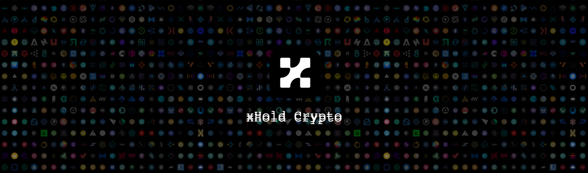

    

    
    

    
    
    
    
    

# xHold

    <strong>xHold Crypto Project</strong> is a <del> Lorem Ipsum is simply dummy text of the printing and typesetting industry. Lorem Ipsum has been the industry's standard dummy text ever since the 1500s, when an unknown printer took a galley of type </del>.

 
    We love turn caffeine into code! If this project was useful to you and helped you manage and accumulate your cryptocurrencies of it in some form and you want to support the project, please consider buying us a coffee so we can keep adding new features. 

<!-- ## 0. NavBar  -->

#

 
    

     ⋮⋮⋮⋮⋮⋮⋮⋮
    <a href="#1-about">1. About</a> ⋮⋮⋮⋮⋮⋮
    <a href="#2-demo">2. Demo</a> ⋮⋮⋮⋮⋮⋮
    <a href="#3-contributing">3. Contributing</a> ⋮⋮⋮⋮⋮⋮
    <a href="#4-team">4. Team</a> ⋮⋮⋮⋮⋮⋮
    <a href="#5-license">5. License</a> ⋮⋮⋮⋮⋮⋮
    <a href="#6-contact-and-support">6. Contact and Support</a> ⋮⋮⋮⋮⋮⋮⋮⋮
    

 

#

## 1. About

 xHold crypto is a free and open-source <del> Lorem Ipsum is simply dummy text of the printing and typesetting industry. Lorem Ipsum has been the industry's standard dummy text ever since the 1500s, when an unknown printer took a galley of type and scrambled it to make a type specimen book. It has survived not only five centuries, but also the leap into electronic typesetting, remaining essentially unchanged </del>. 

 xHold crypto spreadsheet script was released from beta, as version v0.0.1beta, on 1 July 2022. It is fully customizable in TypeScript. 

## 2. Demo

 <del> Lorem Ipsum is simply dummy text of the printing and typesetting industry. Lorem Ipsum has been the industry's standard dummy text ever since the 1500s, when an unknown printer took a galley of type and scrambled it to make a type specimen book </del>. 

    

## 3. Contributing

 <del> Lorem Ipsum is simply dummy text of the printing and typesetting industry. Lorem Ipsum has been the industry's standard dummy text ever since the 1500s, when an unknown printer took a galley of type and scrambled it to make a type specimen book. It has survived not only five centuries, but also the leap into electronic typesetting, remaining essentially unchanged. It was popularised in the 1960s with the release of Letraset sheets containing Lorem Ipsum passages, and more recently with desktop publishing software like Aldus PageMaker including versions of Lorem Ipsum <del>. 

## 4. Team

 <del> Lorem Ipsum is simply dummy text of the printing and typesetting industry. Lorem Ipsum has been the industry's standard dummy text ever since the 1500s, when an unknown printer took a galley of type and scrambled it to make a type specimen book </del>. 

| DEVELOPER            | UI/UX               | TESTER                |  PRODUCT OWNER               |
| :------------------: | :------------------:| :--------------------:| :---------------------------:|
 |  |  | 
| [Alex Aquino](https://github.com/alexaquino) | [Alex Aquino](https://github.com/alexaquino) | [Alex Aquino](https://github.com/alexaquino) | [Alex Aquino](https://github.com/alexaquino) |

## 5. License

Copyright (c) 2022 Alex Aquino / xHold Crypto Project.   
Licensed under the [MIT](LICENSE.txt) license.

## 6. Contact and Support

    
    
    
    

    
    

 We love turn caffeine into code! If this project was useful to you and helped you manage and accumulate your cryptocurrencies of it in some form and you want to support the project, please consider buying us a coffee so we can keep adding new features. 

