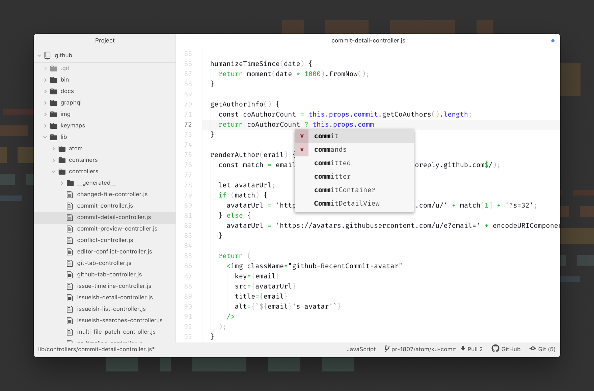

    

    
    
    
    
    
    

# ATOM

 <strong>Atom</strong> is a hackable text editor for the 21st century, built on Electron, and based on everything we love about our favorite editors. We designed it to be deeply customizable, but still approachable using the default configuration. 

  

   ⋮⋮⋮⋮⋮⋮⋮⋮⋮⋮⋮⋮⋮⋮⋮⋮⋮
  <a href="#1-about">1. About</a> ⋮⋮⋮
  <a href="#2-installing">2. Installing</a> ⋮⋮⋮
  <a href="#3-demo">3. Demo</a> ⋮⋮⋮
  <a href="#4-contributing">4. Contributing</a> ⋮⋮⋮
  <a href="#5-team">5. Team</a> ⋮⋮⋮
  <a href="#6-license">6. License</a> ⋮⋮⋮⋮⋮⋮⋮⋮⋮⋮⋮⋮⋮⋮⋮⋮⋮

  

## 1. About

 Atom is a free and open-source text and source code editor for macOS, Linux, and Microsoft Windows with support for plug-ins written in Node.js, and embedded Git Control, developed by GitHub. Atom is a desktop application built using web technologies. Most of the extending packages have free software licenses and are community-built and maintained. Atom is based on Electron (formerly known as Atom Shell), a framework that enables cross-platform desktop applications using Chromium and Node.js. It is written in CoffeeScript and Less. 

 Atom was released from beta, as version 1.0, on 25 June 2015. Its developers call it a "hackable text editor for the 21st Century". It is fully customizable in HTML, CSS, and JavaScript. 

## 2. Installing

 Lorem Ipsum is simply dummy text of the printing and typesetting industry. Lorem Ipsum has been the industry's standard dummy text ever since the 1500s, when an unknown printer took a galley of type and scrambled it to make a type specimen book. It has survived not only five centuries, but also the leap into electronic typesetting, remaining essentially unchanged. It was popularised in the 1960s with the release of Letraset sheets containing Lorem Ipsum passages, and more recently with desktop publishing software like Aldus PageMaker including versions of Lorem Ipsum. 

## 3. Demo

 Lorem Ipsum is simply dummy text of the printing and typesetting industry. Lorem Ipsum has been the industry's standard dummy text ever since the 1500s, when an unknown printer took a galley of type and scrambled it to make a type specimen book. 

    

## 4. Contributing

 Lorem Ipsum is simply dummy text of the printing and typesetting industry. Lorem Ipsum has been the industry's standard dummy text ever since the 1500s, when an unknown printer took a galley of type and scrambled it to make a type specimen book. It has survived not only five centuries, but also the leap into electronic typesetting, remaining essentially unchanged. It was popularised in the 1960s with the release of Letraset sheets containing Lorem Ipsum passages, and more recently with desktop publishing software like Aldus PageMaker including versions of Lorem Ipsum. 

## 5. Team

 Lorem Ipsum is simply dummy text of the printing and typesetting industry. Lorem Ipsum has been the industry's standard dummy text ever since the 1500s, when an unknown printer took a galley of type and scrambled it to make a type specimen book. 

| DEVELOPER            | DEVELOPER           | DEVELOPER           |  DESIGNER UX/UI     | 
| :------------------: | :------------------:| :------------------:| :------------------:|
 |  |  | 
| [@alexaquino](https://www.google.com) | [@alexaquino](https://www.google.com) | [@alexaquino](https://www.google.com)| [@alexaquino](https://www.google.com) | 

## 6. License

Copyright (c) Alex Aquino. All rights reserved.  
Licensed under the [MIT](LICENSE.txt) license.

## 7. Contact

    
    
    
    

 Lorem Ipsum is simply dummy text of the printing and typesetting industry. Lorem Ipsum has been the industry's standard dummy text ever since the 1500s, when an unknown printer took a galley of type and scrambled it to make a type specimen book. 

